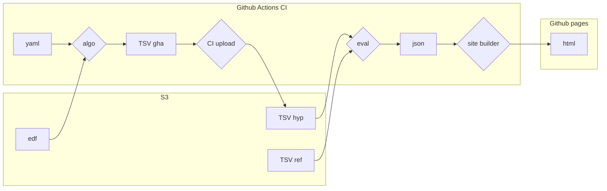

# SZcore

## Background

This repository hosts an open seizure detection benchmarking platform.
The aim is to provide an open source platform for the community to submit their seizure detection algorithms and provide automatic benchmark results on various high quality datasets.

## Usage

Users can submit a containerized algorithm by opening a PR adding a yaml file in the `algorithms` directory. The yaml file should describe their algorithm following our schema (see example (LINK)) and point to a publicly available docker image based on our template (see config/template.Dockerfile).

Once the PR is merged, this image is used to execute the algorithm on github actions, compute performance metrics and update a static website hosted on github pages.

## Data flow

## Acknowledgement

This project was developed as part of the [ORD for the Sciences hackathon](https://sdsc-hackathons.ch/) organized by [EPFL Open Science](https://www.epfl.ch/research/open-science/) and [SDSC](http://datascience.ch/) by the team "zinalrothorn", composed of [@EishaMazhar](https://github.com/EishaMazhar), [@danjjl](https://github.com/danjjl), [@esthertsw](https://github.com/esthertsw) and [@cmdoret](https://github.com/cmdoret)
